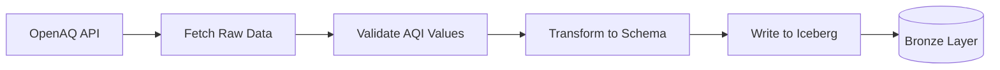

# Pull Request Creation Guidelines

When a user requests to create a Pull Request (PR), follow these steps:

## 1. Code Analysis & Context Gathering

**CRITICAL: You MUST read the complete content of ALL changed files, not just the diff!**

Steps:
1. **Identify base branch**: 
   - If user specifies target branch (e.g., "PR với nhánh develop"), use that branch
   - **DEFAULT**: If not specified, compare against `main` branch
   - Use format: `origin/<base-branch>..HEAD`
2. **Get ALL commits**: Use `git log --oneline origin/<base>..HEAD` to see all commits in this branch
3. Use `get_changed_files` tool to identify all modified, added, or deleted files (comparing to base branch)
4. **For EACH changed file**: Use `read_file` tool to read the ENTIRE file content (from line 1 to end)
5. Search for related files using `semantic_search` or `grep_search` to understand:
   - Parent classes or base implementations
   - Imported modules and dependencies
   - Files that use/call the changed code
6. Read those related files as well to understand the full context
7. **Understand the FULL scope**: This branch may have multiple commits implementing different features - understand ALL of them

## 2. Generate PR Description

Create a PR description with 2-3 sections (Flow Diagram is optional):

### Section 1: Summary (Required)

Write a **bullet-point list** summarizing what this branch implements:

**IMPORTANT**: 
- Look at ALL commits in the branch (use `git log --oneline origin/<base>..HEAD`)
- This branch may implement multiple features/fixes across several commits
- Your summary should cover the FULL scope of the branch, not just the latest commit
- Use bullet points (- or *) for clarity

**Example:**
```markdown
## Summary

- Implements air quality data ingestion from OpenAQ API into Bronze layer
- Adds API client with retry logic and rate limiting
- Creates data validation rules for AQI measurements
- Sets up Iceberg table storage with incremental loading support
- Includes comprehensive unit tests and integration tests
```

### Section 2: Changed Files (Required)

**Group files by directory** and present them in a **collapsible/dropdown format** when multiple files are in the same folder:

**Format:**
```markdown
## Changed Files

<details>
<summary><strong>src/pv_lakehouse/config/</strong> (3 files, +300 lines)</summary>

| File | Change Type | Lines |
|------|-------------|-------|
| settings.py | Added | +244 |
| __init__.py | Added | +7 |
| spark_config.yaml | Added | +49 |

</details>

<details>
<summary><strong>tests/config/</strong> (2 files, +288 lines)</summary>

| File | Change Type | Lines |
|------|-------------|-------|
| test_settings.py | Added | +287 |
| __init__.py | Added | +1 |

</details>

**Root files:**

| File Path | Change Type | Lines |
|-----------|-------------|-------|
| .gitignore | Modified | +6 |
| requirements.txt | Modified | +7 |
```

**Rules:**
- Group files by their parent directory
- Show folder summary with total file count and line changes
- Use `<details>` and `<summary>` HTML tags for folders with 2+ files
- Put root-level files in a separate table at the end
- Sort folders by importance (most significant changes first)

### Section 3: Feature Flow Diagram (Optional - Only if applicable)

**CRITICAL DECISION:** Determine if a flow diagram is needed:

**✅ CREATE diagram when:**
- Branch implements a **sequential workflow** or **process flow**
- There are **multiple interacting components** or **data transformations**
- The feature involves **ETL pipelines**, **API request flows**, or **state machines**
- Understanding the **order of operations** is important
- Multiple features are implemented that have **clear dependencies**

**❌ SKIP diagram when:**
- Changes are purely **configuration updates** or **refactoring**
- Only **adding/updating tests** without new features
- Simple **bug fixes** that don't change flow
- **Documentation-only** changes
- **Dependency updates** or **code cleanup**

**If creating diagram:**

**Title:** Use descriptive title like "Feature Flow", "Data Pipeline Flow", "Request Processing Flow" (NOT "Implementation Flow")

**Guidelines:**
- ALWAYS retrieve syntax docs first: Use `get-syntax-docs-mermaid` tool with "flowchart.md"
- Show the specific **feature workflow** or **data flow** implemented in this branch
- **Include ALL features/changes from ALL commits in the branch**
- Keep it focused on this branch's implementation (not the entire system)
- Use simple, descriptive labels
- ALWAYS validate using `mermaid-diagram-validator` before presenting
- ALWAYS preview using `mermaid-diagram-preview` after validation

**Example:**
```markdown
## Data Ingestion Flow


```

## 3. Complete PR Template

Generate the PR description in this format:

```markdown
# [PR Title]

## Summary
- [Bullet point 1 about main feature]
- [Bullet point 2 about implementation details]
- [Bullet point 3 about additional changes]

## Changed Files
[Grouped by folders with collapsible sections]

## [Feature-Specific Flow Title] (OPTIONAL - only if workflow exists)
[Mermaid diagram showing feature flow - ONLY if applicable]
```

**Note:** The third section (flow diagram) is optional and should only be included if the branch implements a clear workflow or process.

## 4. Save PR to File

**MANDATORY:** Save the PR description to `.pr/<branch-name>.md`

Steps:
1. Get current branch name: `git branch --show-current`
2. Get base branch (usually `origin/main` or `origin/develop`)
3. List all commits in this branch: `git log --oneline origin/main..HEAD`
4. Sanitize branch name (replace `/` with `-`)
5. Create `.pr/` directory if needed
6. Save file with metadata:
```markdown
---
branch: <original-branch-name>
base: main
created: <current-date>
author: GitHub Copilot
commits: <number-of-commits>
---

[PR content here]
```

## 5. Workflow

**When user requests "Create a PR":**
1. ✅ Identify base branch (usually `main` or `develop`)
2. ✅ List ALL commits in branch: `git log --oneline origin/<base>..HEAD`
3. ✅ Use `get_changed_files` to identify ALL changes (vs base branch)
4. ✅ **Read ENTIRE content of ALL changed files** (use `read_file` for each file, line 1 to end)
5. ✅ Search related code for context (use `semantic_search` or `grep_search`)
6. ✅ Read related files to understand implementation
7. ✅ Write bullet-point summary covering ALL features/changes in the branch
8. ✅ Create grouped files table with collapsible sections for folders
9. ✅ **Evaluate if flow diagram is needed** (skip if just config/tests/docs)
10. ✅ If diagram needed: Get Mermaid syntax docs (`get-syntax-docs-mermaid`)
11. ✅ Create flow diagram showing feature workflow (if applicable)
12. ✅ Validate diagram (`mermaid-diagram-validator`)
13. ✅ Preview diagram (`mermaid-diagram-preview`)
14. ✅ Save to `.pr/<branch-name>.md` with commit count
15. ✅ Present to user

---

**Keep it simple:** Summary (bullets) + Files Table (grouped) + Optional Flow Diagram. That's it.