# 🏛️ PV Lakehouse - Architecture Documentation

## 📋 Table of Contents

1. [Overview](#overview)
2. [System Architecture](#system-architecture)
3. [Technology Stack](#technology-stack)
4. [Data Architecture](#data-architecture)
5. [Infrastructure Components](#infrastructure-components)
6. [Data Flow](#data-flow)
7. [Security & Access Control](#security--access-control)
8. [Scalability & Performance](#scalability--performance)
9. [Monitoring & Operations](#monitoring--operations)

---

## Overview

**PV Lakehouse** là một nền tảng Data Lakehouse hoàn chỉnh được xây dựng trên kiến trúc Medallion (Bronze → Silver → Gold) sử dụng Apache Iceberg và các công nghệ open-source. Hệ thống được thiết kế để xử lý dữ liệu năng lượng mặt trời (PV - Photovoltaic) kết hợp với dữ liệu thời tiết và chất lượng không khí.

### 🎯 Core Objectives

- **Data Lake + Data Warehouse**: Kết hợp khả năng lưu trữ linh hoạt của Data Lake với hiệu suất truy vấn của Data Warehouse
- **ACID Transactions**: Đảm bảo tính toàn vẹn dữ liệu qua Apache Iceberg
- **Schema Evolution**: Hỗ trợ thay đổi schema không phá vỡ downstream consumers
- **Time Travel**: Truy vấn dữ liệu tại bất kỳ thời điểm trong quá khứ
- **Multi-Engine Access**: Spark, Trino, và Python có thể truy cập cùng một dữ liệu

---

## System Architecture

### High-Level Architecture Diagram


---

## Technology Stack

### Core Infrastructure (Docker Services)

| Service | Technology | Version | Purpose | Port |
|---------|-----------|---------|---------|------|
| **Object Storage** | MinIO | latest | S3-compatible storage for data lake | 9000 (API), 9001 (Console) |
| **Catalog & Metadata** | PostgreSQL | 15 | Iceberg catalog, MLflow backend | 5432 |
| **Batch Processing** | Apache Spark | 3.5+ | Distributed ETL engine (master + worker) | 7077 (Master), 4040 (UI) |
| **Query Engine** | Trino | latest | Fast SQL analytics over lakehouse | 8081 |
| **ML Platform** | MLflow | 2.4+ | Experiment tracking & model registry | 5000 |
| **Orchestration** | Prefect | 2.x | Workflow scheduling (optional) | 4200 |
| **DB Admin** | pgAdmin | latest | PostgreSQL management UI | 5050 |

### Data Stack

| Component | Technology | Purpose |
|-----------|-----------|---------|
| **Table Format** | Apache Iceberg v2 | ACID transactions, time travel, schema evolution |
| **File Format** | Apache Parquet | Columnar storage with compression |
| **Compute Engine** | PySpark 3.5 | Python API for Spark transformations |
| **SQL Dialect** | ANSI SQL | Trino SQL queries |
| **Data Catalog** | Iceberg REST Catalog | Centralized table metadata |

### Python Libraries

```python
# Core Data Processing
pyspark==3.5.0
pandas==2.2.0
numpy==1.26.0

# API Clients
requests==2.31.0
openmeteo-requests==1.1.0

# ML & Analytics
mlflow==2.4.0
scikit-learn==1.4.0
xgboost==2.0.3

# Database & Storage
psycopg2-binary==2.9.9
boto3==1.34.0 (for S3 access)
```

---

## Data Architecture

### Medallion Architecture Layers

```mermaid
graph LR
    subgraph Bronze["🥉 BRONZE LAYER"]
        direction TB
        B1[Raw Data<br/>Schema-on-Read<br/>Append-Only]
        B2[Tables:<br/>• raw_facilities<br/>• raw_facility_timeseries<br/>• raw_facility_weather<br/>• raw_facility_air_quality]
        B1 --- B2
    end

    subgraph Silver["🥈 SILVER LAYER"]
        direction TB
        S1[Cleansed Data<br/>Deduplicated<br/>Validated]
        S2[Tables:<br/>• clean_facility_master<br/>• clean_hourly_energy<br/>• clean_hourly_weather<br/>• clean_hourly_air_quality]
        S1 --- S2
    end

    subgraph Gold["🥇 GOLD LAYER"]
        direction TB
        G1[Star Schema<br/>Business Ready<br/>Optimized]
        G2[Dimensions:<br/>• dim_date<br/>• dim_time<br/>• dim_facility<br/>• dim_aqi_category]
        G3[Facts:<br/>• fact_solar_environmental<br/>• fact_solar_forecast_regression]
        G1 --- G2
        G1 --- G3
    end

    Bronze -->|Transform| Silver
    Silver -->|Model| Gold

    classDef bronzeStyle fill:#CD7F32,stroke:#8B4513,stroke-width:3px,color:#FFF
    classDef silverStyle fill:#C0C0C0,stroke:#696969,stroke-width:3px
    classDef goldStyle fill:#FFD700,stroke:#DAA520,stroke-width:3px

    class Bronze,B1,B2 bronzeStyle
    class Silver,S1,S2 silverStyle
    class Gold,G1,G2,G3 goldStyle
```



### Data Flow - Incremental vs Backfill


#### 🥉 **Bronze Layer** (Raw/Landing Zone)

**Purpose:** Capture raw data as-is from external sources

**Tables:**
- `iceberg.bronze.raw_facilities` - Facility master data from OpenElectricity
- `iceberg.bronze.raw_facility_timeseries` - 30-min energy generation data
- `iceberg.bronze.raw_facility_weather` - Hourly weather observations
- `iceberg.bronze.raw_facility_air_quality` - Hourly air quality metrics

**Characteristics:**
- ✅ Append-only (immutable)
- ✅ Schema-on-read (minimal validation)
- ✅ Full audit trail (ingestion timestamps)
- ✅ Partitioned by ingestion date
- ✅ Supports incremental and backfill modes

**ETL Scripts:**
- `load_facilities.py` - Facility metadata
- `load_facility_timeseries.py` - Energy data (OpenElectricity API)
- `load_facility_weather.py` - Weather data (OpenMeteo API)
- `load_facility_air_quality.py` - Air quality data (Open-Meteo API)

---

#### 🥈 **Silver Layer** (Cleansed/Normalized)

**Purpose:** Clean, validate, and normalize Bronze data

**Tables:**
- `iceberg.silver.clean_facility_master` - Validated facility metadata
- `iceberg.silver.clean_hourly_energy` - Deduplicated hourly energy aggregates
- `iceberg.silver.clean_hourly_weather` - Normalized hourly weather data
- `iceberg.silver.clean_hourly_air_quality` - Validated hourly AQ metrics

**Transformations:**
1. **Deduplication** - Remove duplicate records via `MERGE` operations
2. **Schema Normalization** - Standardize column names, data types
3. **Data Validation** - Check for nulls, out-of-range values
4. **Quality Flagging** - Add `is_valid` and `quality_score` columns
5. **Business Rules** - Apply regional groupings, facility classifications
6. **Timezone Handling** - Convert UTC to local facility time

**Key Features:**
- ✅ MERGE-based upserts (handles late-arriving data)
- ✅ Composite primary keys (facility_code + date_hour)
- ✅ Data quality metrics (completeness_pct)
- ✅ Supports incremental processing

**ETL Scripts:**
- `silver/cli.py facility_master` - Process facility metadata
- `silver/cli.py hourly_energy` - Aggregate 30-min to hourly
- `silver/cli.py hourly_weather` - Clean weather data
- `silver/cli.py hourly_air_quality` - Validate AQ metrics

---

#### 🥇 **Gold Layer** (Analytics/Star Schema)

**Purpose:** Business-ready dimensional model for BI and ML

**Fact Tables:**

1. **`fact_solar_environmental`** (Grain: 1 hour × 1 facility)
   - Energy metrics: `energy_mwh`, `intervals_count`, `irr_kwh_m2_hour`
   - Weather: temperature, humidity, radiation, cloud cover
   - Air quality: PM2.5, AQI, UV index
   - Quality flags: `completeness_pct`, `quality_flag`, `is_valid`

2. **`fact_solar_forecast_regression`** (Grain: 1 prediction × 1 hour × 1 facility)
   - ML predictions: `predicted_energy_mwh`, `actual_energy_mwh`
   - Error metrics: `absolute_error`, `percentage_error`
   - Model metadata: `model_version_id`, `prediction_timestamp`

**Dimension Tables:**

| Dimension | Purpose | Key Attributes |
|-----------|---------|----------------|
| `dim_date` | Calendar dates | date_key, year, month, quarter, season, is_holiday |
| `dim_time` | Hour-of-day | time_key, hour, day_part (morning/afternoon/evening), is_peak_hour |
| `dim_facility` | PV plants | facility_key, code, name, capacity_mw, region, technology |
| `dim_aqi_category` | AQI ranges | aqi_category_key, category_name (Good/Moderate/Unhealthy), min/max |
| `dim_feature_importance` | ML features | feature_name, importance_score, model_version_id |

**Star Schema Benefits:**
- ⚡ Fast BI queries (pre-joined denormalized facts)
- 📊 Conformed dimensions (shared across fact tables)
- 🔍 Simplified querying (no complex joins required)
- 📈 Optimized for aggregations

**ETL Scripts:**
- `gold/cli.py dim_date` - Generate calendar dimension
- `gold/cli.py dim_time` - Generate time-of-day dimension
- `gold/cli.py dim_facility` - Load facility dimension from Silver
- `gold/cli.py dim_aqi_category` - Static AQI category table
- `gold/cli.py fact_solar_environmental` - Build main fact table
- `gold/cli.py fact_solar_forecast_regression` - Load ML predictions

---

## Infrastructure Components

### Docker Services Architecture


### Network & Security Architecture


### 1. **MinIO (S3-Compatible Object Storage)**

**Purpose:** Data lake storage backend

**Configuration:**
- Bucket: `lakehouse` (versioning enabled)
- Bucket: `mlflow` (for ML artifacts)
- Access: Private (service accounts only)
- Security: Role-based policies (`lakehouse-rw`, `mlflow-rw`)

**Service Accounts:**
```bash
spark_svc     → lakehouse-rw policy (read/write Iceberg tables)
trino_svc     → lakehouse-rw policy (query Iceberg tables)
mlflow_svc    → mlflow-rw policy (store ML models)
```

**Endpoints:**
- API: `http://minio:9000` (internal), `http://localhost:9000` (external)
- Console: `http://localhost:9001`

---

### 2. **PostgreSQL (Metadata Store)**

**Purpose:** Iceberg catalog and MLflow backend

**Databases:**
- `iceberg` - Iceberg REST catalog metadata
- `mlflow` - MLflow experiment tracking database
- `postgres` - Default admin database

**Tables (Iceberg schema):**
- `iceberg_tables` - Table registry
- `iceberg_snapshots` - Snapshot history
- `iceberg_files` - Data file manifests

**Connection:**
```bash
Host: postgres
Port: 5432
User: pvlakehouse
Password: pvlakehouse
```

---

### 3. **Apache Spark (Batch Processing)**

**Architecture:** Master-Worker cluster

**Master Node:**
- Coordinates job execution
- Manages worker registration
- Spark UI: `http://localhost:4040`

**Worker Node(s):**
- Executes tasks (map, reduce, join)
- Memory: Configurable via `SPARK_WORKER_MEMORY` (default 12G)
- Cores: Configurable via `SPARK_WORKER_CORES` (default 20)

**Iceberg Integration:**
```python
spark = SparkSession.builder \
    .appName("ETL") \
    .config("spark.sql.extensions", "org.apache.iceberg.spark.extensions.IcebergSparkSessionExtensions") \
    .config("spark.sql.catalog.iceberg", "org.apache.iceberg.spark.SparkCatalog") \
    .config("spark.sql.catalog.iceberg.type", "rest") \
    .config("spark.sql.catalog.iceberg.uri", "http://iceberg-rest:8181") \
    .getOrCreate()
```

**Deployment:**
```bash
# Submit Spark job
docker compose exec spark-master spark-submit \
  --master spark://spark-master:7077 \
  --deploy-mode client \
  --driver-memory 3g \
  --executor-memory 8g \
  /opt/workdir/src/pv_lakehouse/etl/bronze/load_facilities.py
```

---

### 4. **Trino (SQL Query Engine)**

**Purpose:** Fast interactive SQL queries over Iceberg tables

**Catalogs:**
- `iceberg` - Iceberg tables via REST catalog
- `system` - Trino system metadata

**Query Example:**
```sql
-- Query Gold layer
SELECT 
  f.facility_name,
  d.year_month,
  SUM(fse.energy_mwh) as total_energy_mwh,
  AVG(fse.temperature_2m) as avg_temperature
FROM iceberg.gold.fact_solar_environmental fse
JOIN iceberg.gold.dim_facility f ON fse.facility_key = f.facility_key
JOIN iceberg.gold.dim_date d ON fse.date_key = d.date_key
WHERE d.year = 2024
GROUP BY f.facility_name, d.year_month
ORDER BY total_energy_mwh DESC;
```

**Performance Features:**
- ⚡ Predicate pushdown (filter early)
- 📂 Partition pruning (skip irrelevant files)
- 🗜️ Columnar reads (read only needed columns)
- 🔍 Iceberg metadata optimization

---

### 5. **MLflow (ML Platform)**

**Purpose:** Track experiments, log models, deploy predictions

**Components:**
- **Tracking Server**: Log experiments, parameters, metrics
- **Model Registry**: Version and deploy models
- **Artifact Store**: MinIO backend for model artifacts

**Integration:**
```python
import mlflow

mlflow.set_tracking_uri("http://mlflow:5000")
mlflow.set_experiment("solar_forecasting")

with mlflow.start_run():
    mlflow.log_param("model_type", "XGBoost")
    mlflow.log_metric("rmse", 0.15)
    mlflow.sklearn.log_model(model, "model")
```

**UI:** `http://localhost:5000`

---

### 6. **Prefect (Orchestration - Optional)**

**Purpose:** Schedule and monitor ETL workflows

**Features:**
- 📅 Cron-based scheduling
- 🔄 Retry logic and error handling
- 📊 Flow run monitoring
- 🚨 Alerting on failures

**Example Flow:**
```python
from prefect import flow, task

@task
def load_bronze():
    # Run Spark job
    pass

@task
def transform_silver():
    # Run transformation
    pass

@flow(name="daily_etl")
def daily_etl_flow():
    load_bronze()
    transform_silver()

if __name__ == "__main__":
    daily_etl_flow()
```

---

## Data Flow

### ETL Workflow - Complete Pipeline


### ML Training Pipeline

```mermaid
flowchart LR
    subgraph Gold["🥇 Gold Layer"]
        Fact[(fact_solar_environmental)]
        Dims[(Dimension Tables)]
    end

    subgraph Feature["📊 Feature Engineering"]
        Extract[Extract Features]
        Transform[Transform & Encode]
        Split[Train/Test Split]
    end

    subgraph Training["🤖 ML Training"]
        Train[Train Models<br/>XGBoost/RandomForest]
        Tune[Hyperparameter Tuning]
        Validate[Cross-Validation]
    end

    subgraph MLflow["📈 MLflow"]
        Log[Log Metrics<br/>RMSE, MAE, R²]
        Register[Register Model]
        Version[Model Versioning]
    end

    subgraph Deploy["🚀 Deployment"]
        Load[Load Model]
        Predict[Generate Predictions]
        Write[(Write to<br/>fact_solar_forecast_regression)]
    end

    subgraph Monitor["📉 Monitoring"]
        Drift[Monitor Data Drift]
        Performance[Track Performance]
        Retrain{Need Retrain?}
    end

    Fact --> Extract
    Dims --> Extract
    Extract --> Transform
    Transform --> Split
    
    Split --> Train
    Train --> Tune
    Tune --> Validate
    
    Validate --> Log
    Log --> Register
    Register --> Version
    
    Version --> Load
    Load --> Predict
    Predict --> Write
    
    Write --> Drift
    Drift --> Performance
    Performance --> Retrain
    Retrain -->|Yes| Train
    Retrain -->|No| Monitor

    classDef goldStyle fill:#FFD700,stroke:#DAA520,stroke-width:2px
    classDef featureStyle fill:#E1F5FE,stroke:#0277BD,stroke-width:2px
    classDef trainStyle fill:#F3E5F5,stroke:#7B1FA2,stroke-width:2px
    classDef mlflowStyle fill:#FFF9C4,stroke:#F9A825,stroke-width:2px
    classDef deployStyle fill:#C8E6C9,stroke:#388E3C,stroke-width:2px
    classDef monitorStyle fill:#FFCCBC,stroke:#E64A19,stroke-width:2px

    class Gold,Fact,Dims goldStyle
    class Feature,Extract,Transform,Split featureStyle
    class Training,Train,Tune,Validate trainStyle
    class MLflow,Log,Register,Version mlflowStyle
    class Deploy,Load,Predict,Write deployStyle
    class Monitor,Drift,Performance,Retrain monitorStyle
```



### 1. **Initial Setup (Backfill Mode)**

```
Step 1: Load Bronze (Raw Data)
  ├─ load_facilities.py --mode backfill
  ├─ load_facility_timeseries.py --mode backfill --date-start 2024-01-01 --date-end 2025-12-22
  ├─ load_facility_weather.py --mode backfill --start 2024-01-01 --end 2025-12-22
  └─ load_facility_air_quality.py --mode backfill --start 2024-01-01 --end 2025-12-22

Step 2: Transform Silver (Clean Data)
  ├─ silver/cli.py facility_master --mode full
  ├─ silver/cli.py hourly_energy --mode full
  ├─ silver/cli.py hourly_weather --mode full
  └─ silver/cli.py hourly_air_quality --mode full

Step 3: Build Gold (Analytics Layer)
  ├─ gold/cli.py dim_date --mode full
  ├─ gold/cli.py dim_time --mode full
  ├─ gold/cli.py dim_facility --mode full
  ├─ gold/cli.py dim_aqi_category --mode full
  └─ gold/cli.py fact_solar_environmental --mode full
```

---

### 2. **Daily Incremental Load**

```
Step 1: Incremental Bronze Load (New Data Only)
  ├─ load_facility_timeseries.py --mode incremental  → Fetches yesterday's data
  ├─ load_facility_weather.py --mode incremental     → Fetches yesterday's data
  └─ load_facility_air_quality.py --mode incremental → Fetches yesterday's data

Step 2: Incremental Silver Transform (Merge New Records)
  ├─ silver/cli.py hourly_energy --mode incremental --load-strategy merge
  ├─ silver/cli.py hourly_weather --mode incremental --load-strategy merge
  └─ silver/cli.py hourly_air_quality --mode incremental --load-strategy merge

Step 3: Incremental Gold Load (Update Fact Tables)
  ├─ gold/cli.py dim_date --mode incremental --load-strategy merge  → Add new dates
  └─ gold/cli.py fact_solar_environmental --mode incremental --load-strategy merge
```

**Incremental Processing Benefits:**
- ⚡ Faster execution (only new data)
- 💰 Lower compute cost
- 🔄 Handles late-arriving data via MERGE
- 📊 Maintains data consistency

---

### 3. **ML Training Pipeline**

```
Step 1: Feature Engineering (Gold Layer)
  └─ Query fact_solar_environmental + dimensions
     → Extract features: weather, time-of-day, historical energy

Step 2: Train Model (MLflow)
  ├─ Load features from Gold layer
  ├─ Train XGBoost/RandomForest model
  ├─ Log metrics (RMSE, MAE, R²)
  └─ Register model in MLflow registry

Step 3: Generate Predictions
  ├─ Load model from MLflow
  ├─ Score new data
  └─ Write predictions to fact_solar_forecast_regression

Step 4: Feature Importance
  └─ Extract feature importance from model
     → Write to dim_feature_importance
```

---

## Security & Access Control

### MinIO IAM Policies

**`lakehouse-rw` (Spark/Trino):**
```json
{
  "Version": "2012-10-17",
  "Statement": [{
    "Effect": "Allow",
    "Action": ["s3:*"],
    "Resource": ["arn:aws:s3:::lakehouse/*"]
  }]
}
```

**`mlflow-rw` (MLflow):**
```json
{
  "Version": "2012-10-17",
  "Statement": [{
    "Effect": "Allow",
    "Action": ["s3:*"],
    "Resource": ["arn:aws:s3:::mlflow/*"]
  }]
}
```

### Network Security

**Docker Network:** `data-net` (internal communication)

**Exposed Ports (localhost only):**
- MinIO Console: 9001
- Spark UI: 4040
- Trino: 8081
- MLflow: 5000
- Prefect: 4200
- pgAdmin: 5050

**Production Recommendations:**
- 🔒 Use HTTPS/TLS for all external connections
- 🔑 Rotate service account credentials
- 🚪 Implement network firewalls
- 📝 Enable audit logging in MinIO

---

## Scalability & Performance

### Configuration & Resource Allocation

**Hardware Requirements (Minimum):**
- CPU: 8+ cores (recommended 16+)
- RAM: 8GB minimum (recommended 12-16GB+)
- Disk: 100GB minimum (recommended 500GB+ for data lake)

**Spark Configuration (Customizable):**
```bash
SPARK_WORKER_CORES=20          # Adjust based on available CPU cores
SPARK_WORKER_MEMORY=8G         # Adjust based on available RAM
SPARK_WORKER_MEMORY_LIMIT=12g  # Set to ~80% of total available
```

**Spark Job Allocation (Tunable):**
```bash
--driver-memory 2g-3g       # Driver JVM heap (adjust as needed)
--executor-memory 4g-8g     # Executor JVM heap (adjust as needed)
```

**Sizing Recommendations:**
- Small setup (8 cores, 8GB RAM): `--driver-memory 2g --executor-memory 2g`
- Medium setup (16 cores, 16GB RAM): `--driver-memory 3g --executor-memory 6g`
- Large setup (32+ cores, 32GB+ RAM): `--driver-memory 3g --executor-memory 8g+`

### Performance Tuning Tips

1. **Partitioning Strategy**
   - Bronze: Partition by `ingestion_date`
   - Silver: Partition by `date_hour`
   - Gold: Partition by `date_key` (monthly)

2. **File Sizing**
   - Target: 128MB - 512MB per Parquet file
   - Use `OPTIMIZE` command to compact small files

3. **Iceberg Table Maintenance**
   ```sql
   -- Remove old snapshots
   CALL iceberg.system.expire_snapshots('iceberg.bronze.raw_facility_timeseries', TIMESTAMP '2024-01-01 00:00:00');
   
   -- Compact data files
   CALL iceberg.system.rewrite_data_files('iceberg.silver.clean_hourly_energy');
   ```

4. **Trino Query Optimization**
   - Use `EXPLAIN` to analyze query plans
   - Add WHERE filters on partition columns
   - Avoid `SELECT *` (specify columns)

### Scaling Beyond Single Node

**Horizontal Scaling Options:**
1. **Spark Cluster**: Add more worker nodes
2. **Trino Cluster**: Add coordinator + workers
3. **MinIO Distributed**: Multi-node S3 cluster
4. **PostgreSQL HA**: Replication + failover

---

## Monitoring & Operations

### Health Checks

**Docker Compose Health Checks:**
```bash
# Check all services
docker compose -f docker/docker-compose.yml ps

# Check MinIO health
curl http://localhost:9000/minio/health/ready

# Check Spark master
curl http://localhost:4040
```

### Logging

**Spark Logs:**
```bash
docker compose -f docker/docker-compose.yml logs spark-master
docker compose -f docker/docker-compose.yml logs spark-worker
```

**Application Logs:**
```python
import logging

logger = logging.getLogger(__name__)
logger.info("ETL job started")
```

### Metrics to Monitor

| Metric | Source | Alert Threshold |
|--------|--------|----------------|
| Spark job duration | Spark UI | > 30 min (incremental) |
| MinIO disk usage | MinIO console | > 80% |
| PostgreSQL connections | pgAdmin | > 80 connections |
| Trino query latency | Trino UI | > 10s (Gold queries) |
| Data freshness | Custom query | > 24 hours |

### Backup & Recovery

**Backup Strategy:**
1. **MinIO Data**: S3 versioning + replication
2. **PostgreSQL**: Daily pg_dump
3. **Iceberg Metadata**: Snapshot retention (30 days)

**Disaster Recovery:**
```bash
# Export Gold layer to CSV (backup)
docker compose exec spark-master spark-submit \
  /opt/workdir/src/pv_lakehouse/etl/scripts/export_to_csv.py

# Restore from Bronze layer (replay transformations)
# Re-run Silver + Gold ETL pipelines
```

---

## Best Practices

### 1. **Data Quality**
- ✅ Always validate data at Silver layer
- ✅ Add `quality_flag` and `is_valid` columns
- ✅ Track `completeness_pct` for fact tables

### 2. **Schema Evolution**
- ✅ Use Iceberg schema evolution (add columns safely)
- ✅ Never drop columns (mark as deprecated)
- ✅ Test schema changes in dev environment

### 3. **Incremental Processing**
- ✅ Use `--mode incremental` for daily loads
- ✅ Implement MERGE logic for upserts
- ✅ Handle late-arriving data gracefully

### 4. **Testing**
- ✅ Unit test transformation logic
- ✅ Integration test full ETL pipeline
- ✅ Validate data quality after each layer

### 5. **Documentation**
- ✅ Document table schemas in `doc/schema/`
- ✅ Keep CHEATSHEET_GUIDE.md up-to-date
- ✅ Comment complex SQL transformations

---

## Related Documentation

- [Bronze Layer Design](schema/BRONZE_LAYER_DESIGN.md) - Raw data ingestion specs
- [Silver Layer Design](schema/SILVER_LAYER_DESIGN.md) - Transformation rules
- [Gold Layer Design](schema/GOLD_LAYER_DESIGN.md) - Star schema details
- [ETL Operations Guide](bronze-silver/ETL_OPERATIONS_GUIDE.md) - Running ETL jobs
- [Cheatsheet Guide](../src/pv_lakehouse/etl/scripts/CHEATSHEET_GUIDE.md) - Quick commands
- [Trino Connection Guide](power-bi/TRINO_CONNECTION_GUIDE.md) - Power BI integration

---

## Summary

PV Lakehouse cung cấp một kiến trúc hoàn chỉnh cho data lakehouse với:

- 🏗️ **Medallion Architecture** (Bronze → Silver → Gold)
- 🐳 **Containerized Deployment** (Docker Compose)
- 📊 **Dimensional Modeling** (Star Schema)
- ⚡ **High Performance** (Iceberg + Parquet + Spark)
- 🤖 **ML-Ready** (MLflow integration)
- 🔒 **Enterprise Security** (IAM policies, audit trails)
- 📈 **Scalable Design** (horizontal scaling ready)
- 🔧 **Flexible Configuration** (adaptable to various hardware)

Hệ thống được thiết kế để hoạt động trên nhiều loại máy khác nhau, từ máy tính phát triển đơn giản đến các cụm máy chủ sản xuất.
